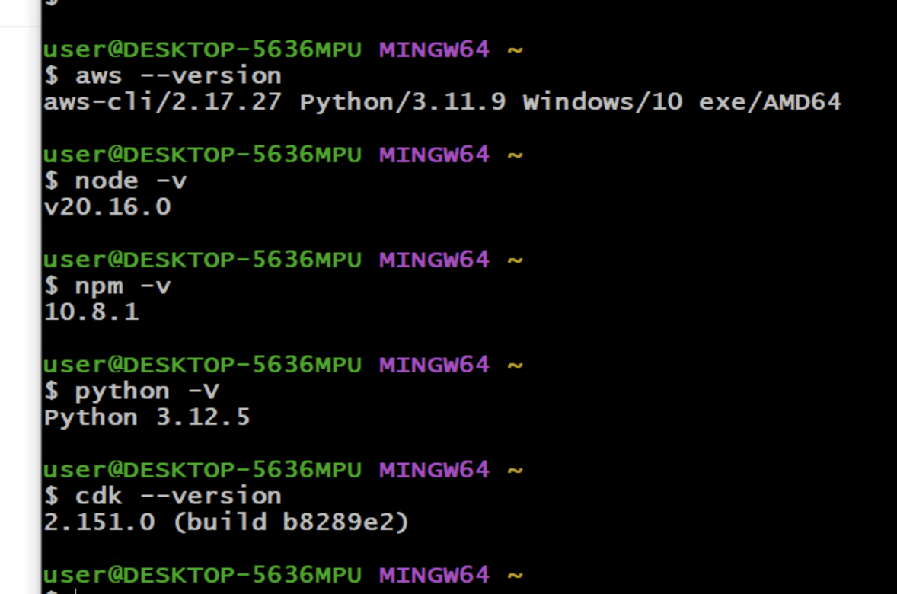
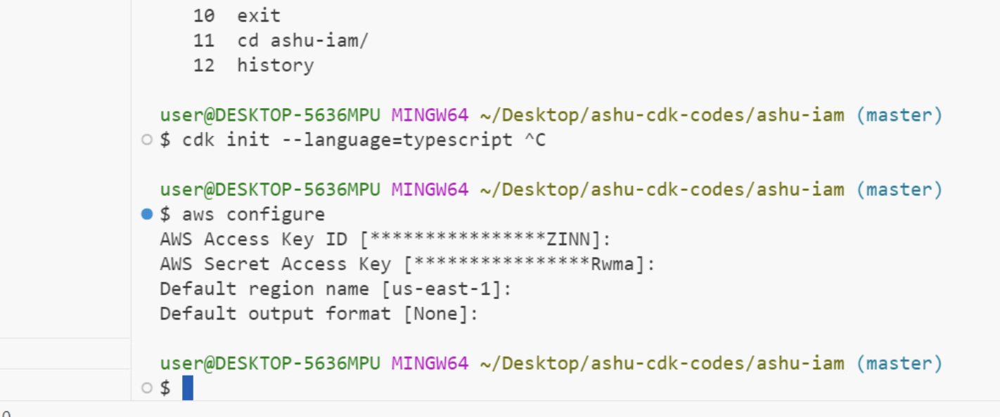

# bmo-aws-platformSVC

## Verify lab details 

## Understanding Identity service 

### aws Identity using IAM 

## creating user in iam 

### creating cdk project with init 

### cdk + aws command 

