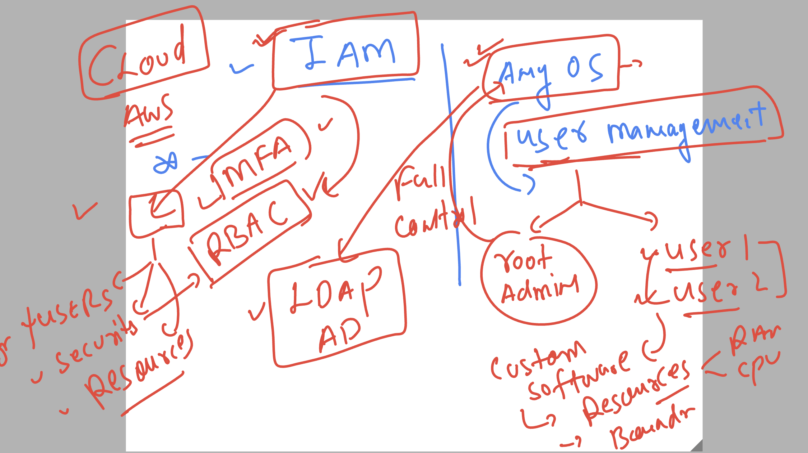

# bmo-aws-platformSVC

## Verify lab details 

## Understanding Identity service 

### aws Identity using IAM 

## creating user in iam 

### creating cdk project with init 

### cdk + aws command 

## Now creating iam group using aws cdk typescript  -- synth 

### creating deploy -- deploy 

### upating group with existing user + resource using name and arn 

### deploy code with no rollback option 

