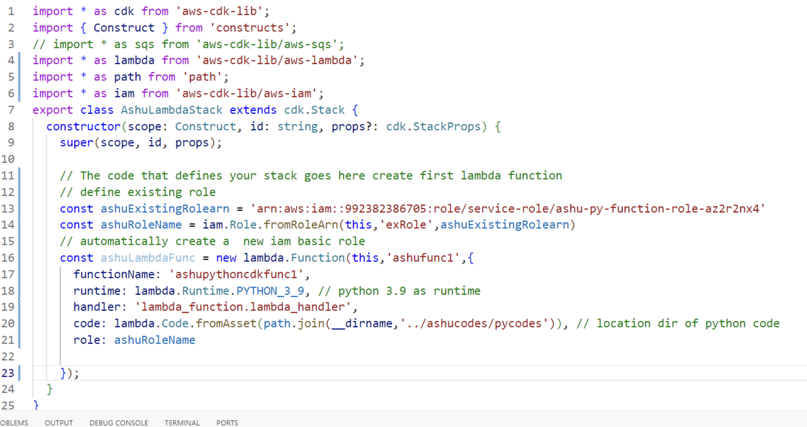
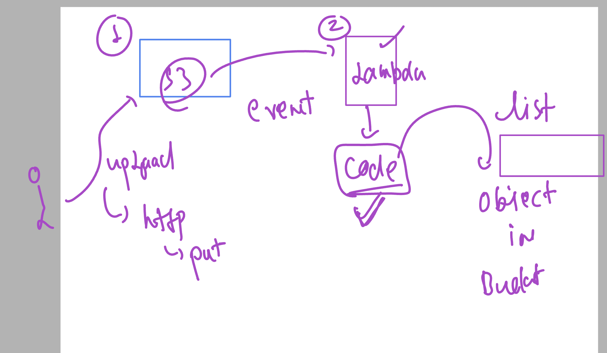
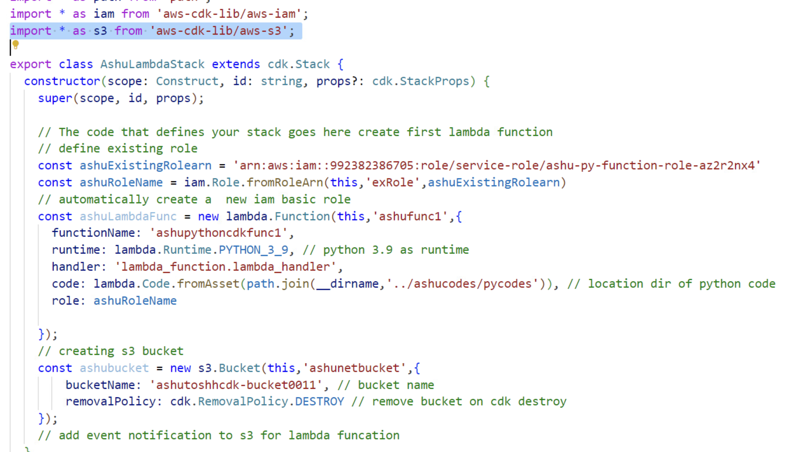
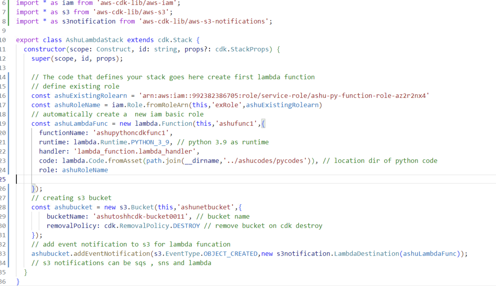
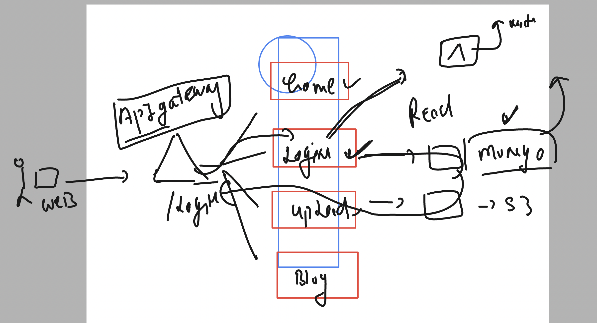
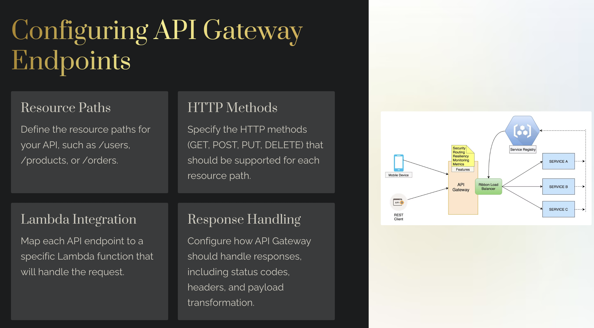

### serverless concept in aws


### serverless -- Event driven 


### some benefits


## Understanding aws lambda -- approach of serverless computing 


### Creating lambda function with 3 options 


### cdk for creating lambda funcation 


### role name 

```
arn:aws:iam::992382386705:role/service-role/ashu-py-function-role-az2r2nx4
```

### cdk for using existing role for lambda funcation creation 



### triggering lambda funcation on behalf of s3 upload event 



### cdk code to create s3 bucket with lambda funcation 



### cdk with s3 notification 




### understanding apigateway 



### more info 




