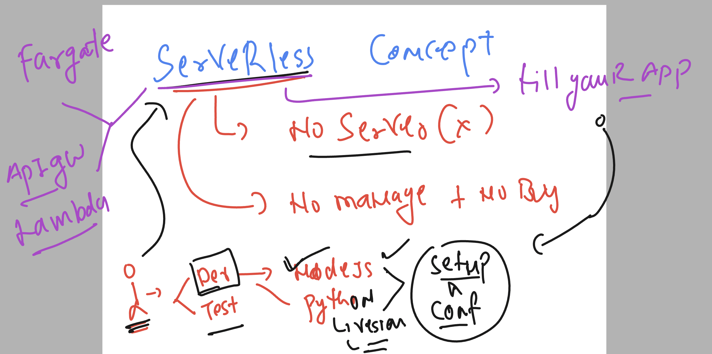
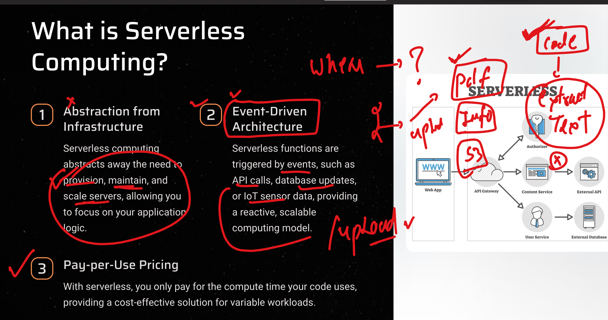
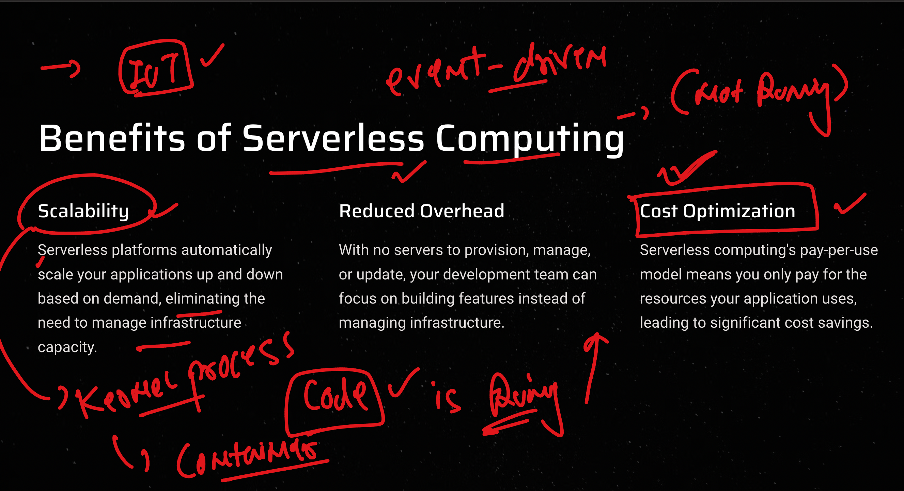
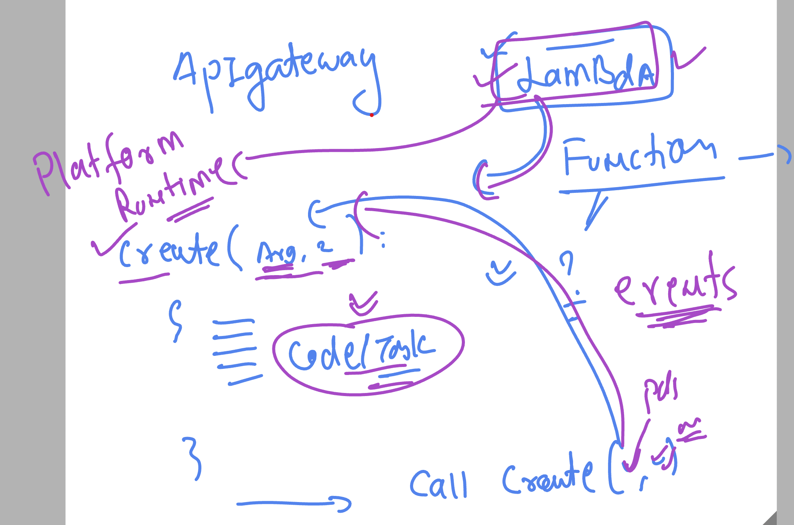
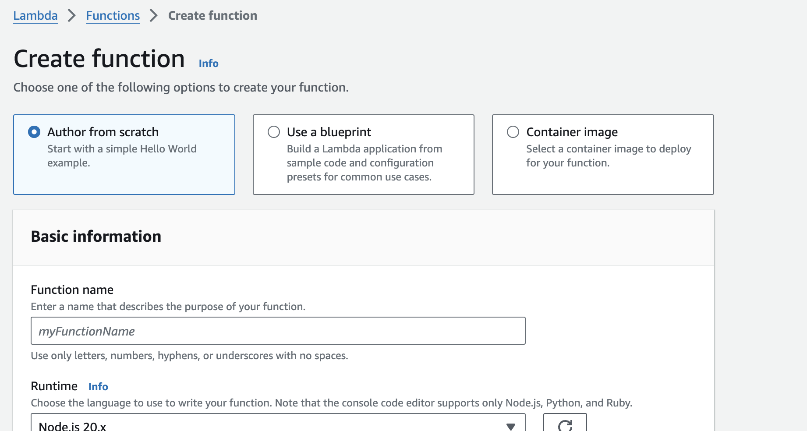
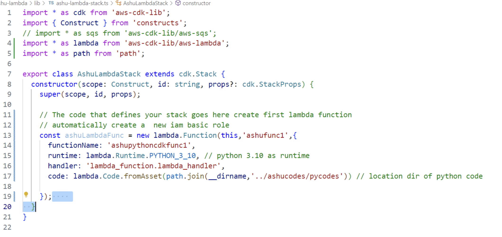

### serverless concept in aws



### serverless -- Event driven 



### some benefits



## Understanding aws lambda -- approach of serverless computing 



### Creating lambda function with 3 options 



### cdk for creating lambda funcation 



### role name 

```
arn:aws:iam::992382386705:role/service-role/ashu-py-function-role-az2r2nx4
```


