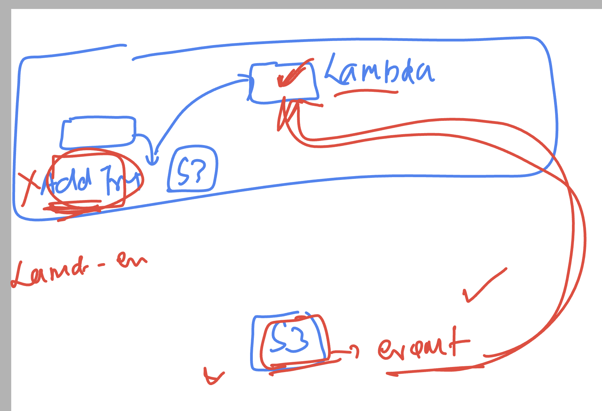
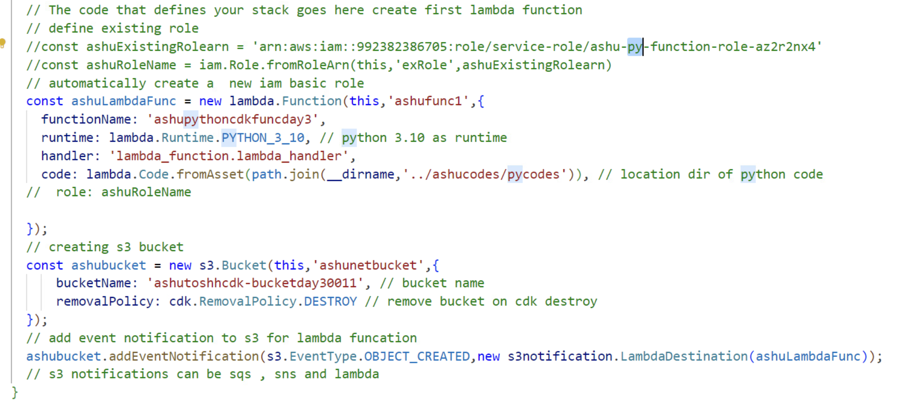
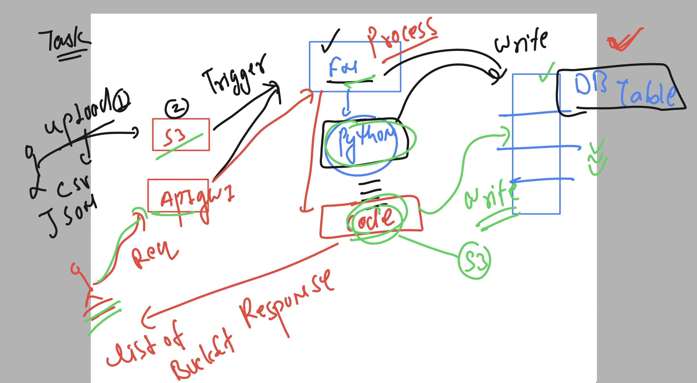
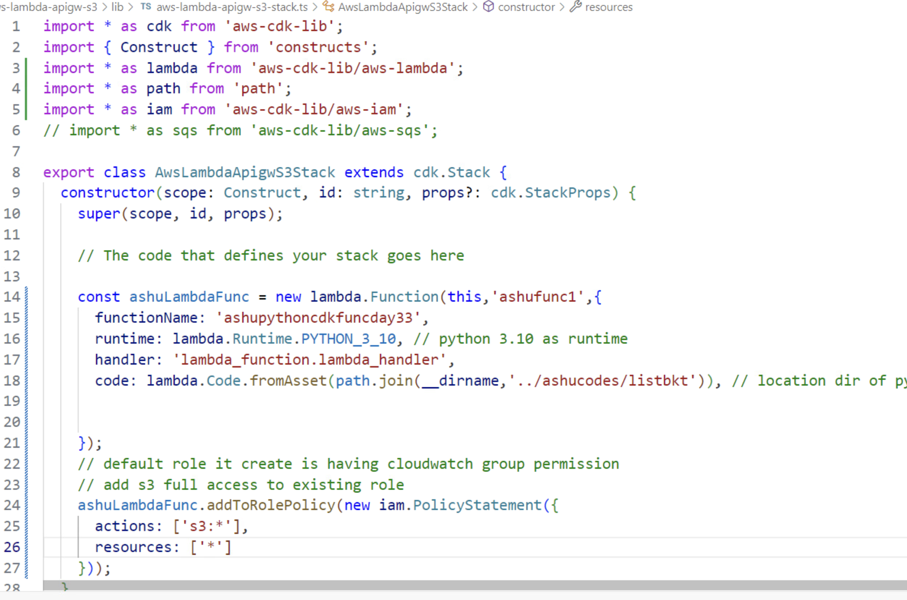
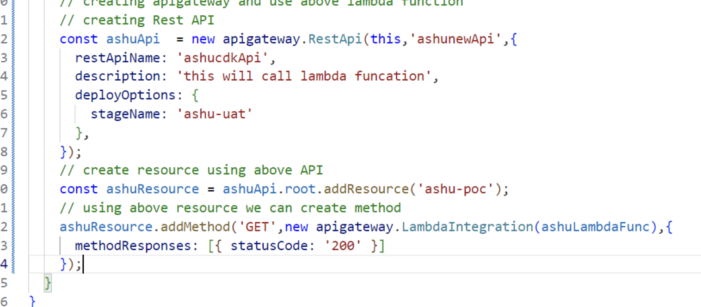
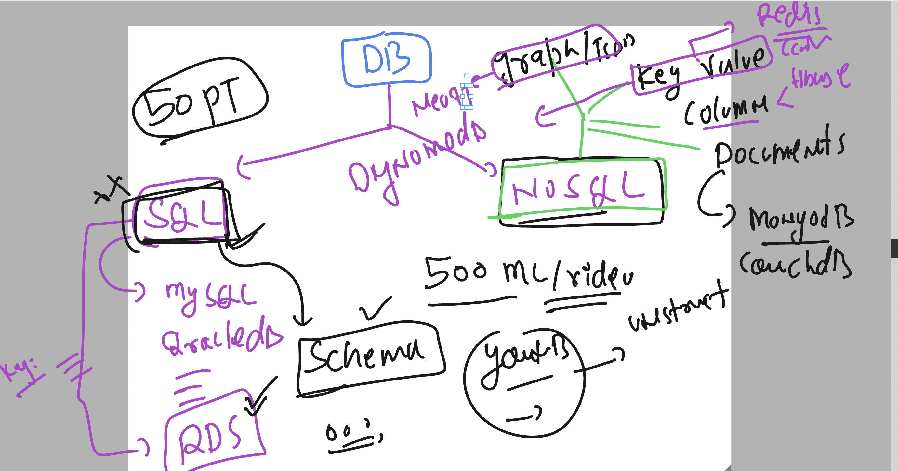
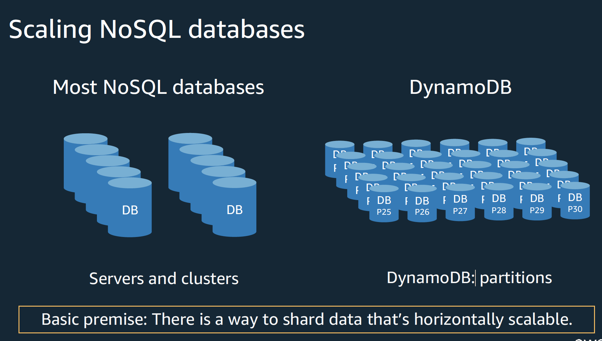
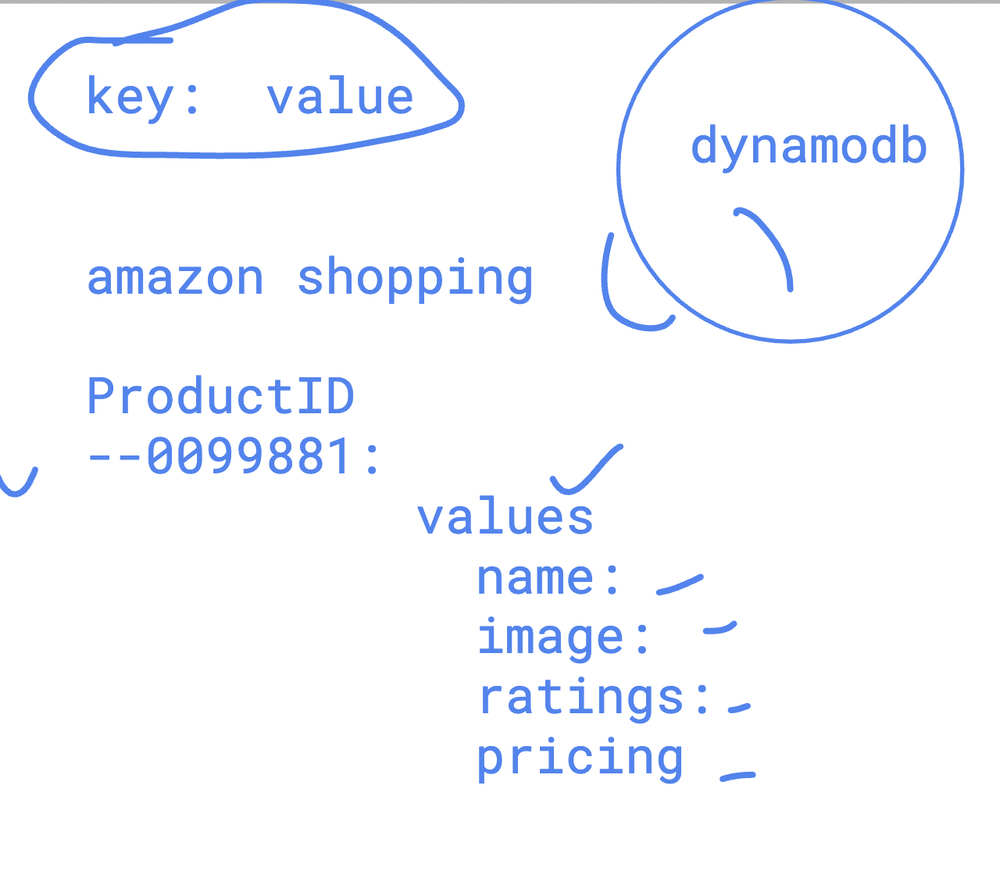
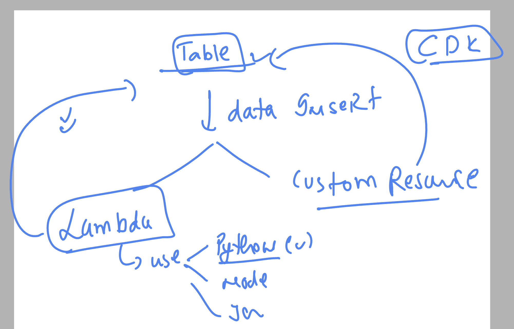
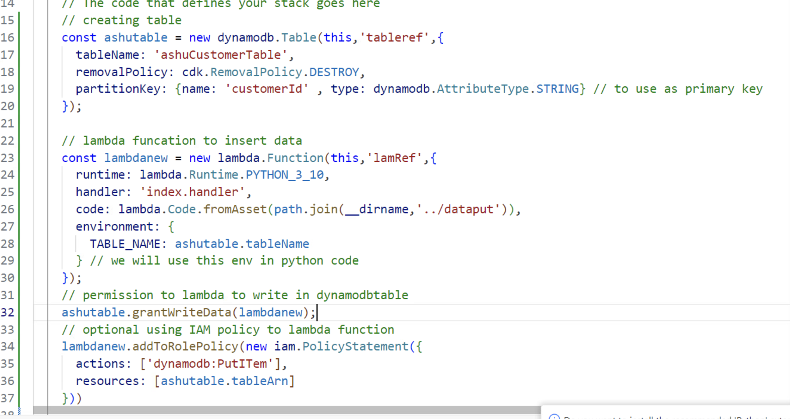

## Creating cdk based lambda triggered by s3 

### Lambda to s3  OR s3 to lambda 

### lambda code with s3 trigger

### Understanding apigw with python and db 

### cdk code 

### adding final code 

## Introducing SQL vs NoSQL 

## partition approach for storing info which is auto managed by aws 

### specific info about key value pair based nosql DB 

### to inset data in dynamodb table using CDK 

### cdk typescript for dynamodb table 

