# bmo-aws-platformSVC

### Revision 

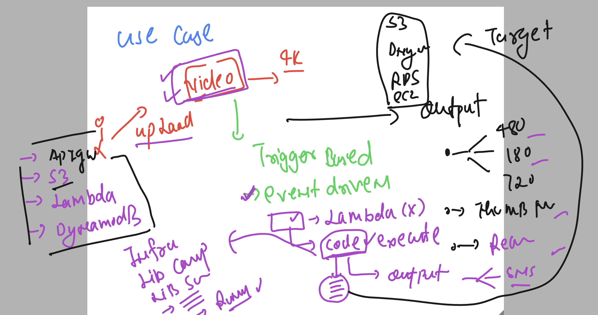

### Understanding lambda base use case 

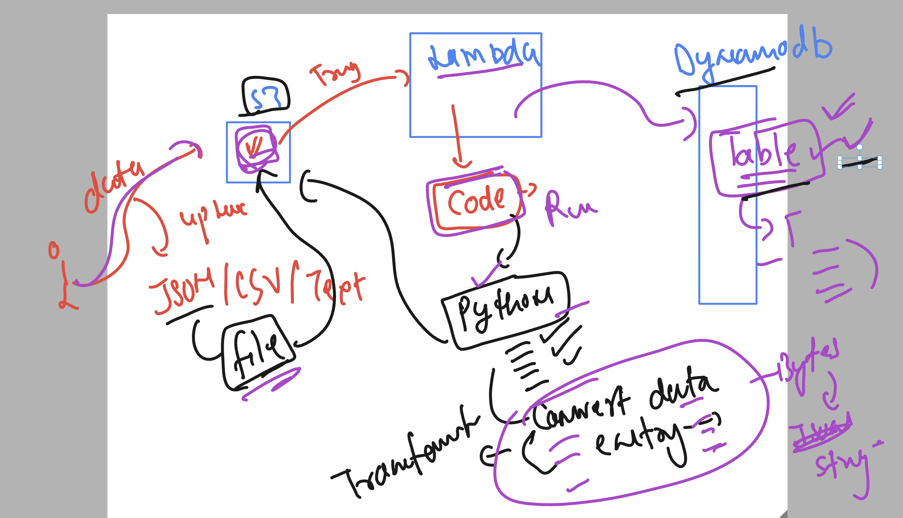

## Bigdata as problem 

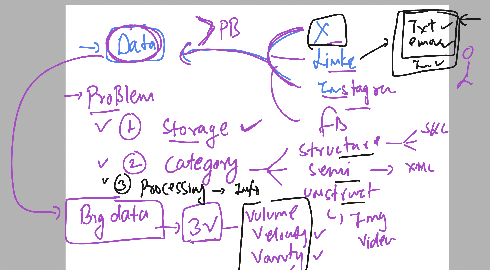

## Introduction apache hadoop 

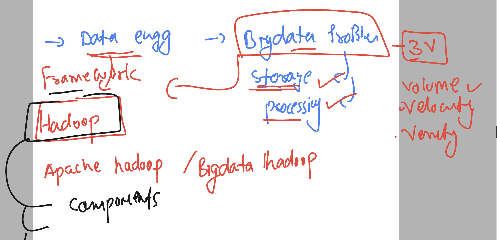

### HDFS 

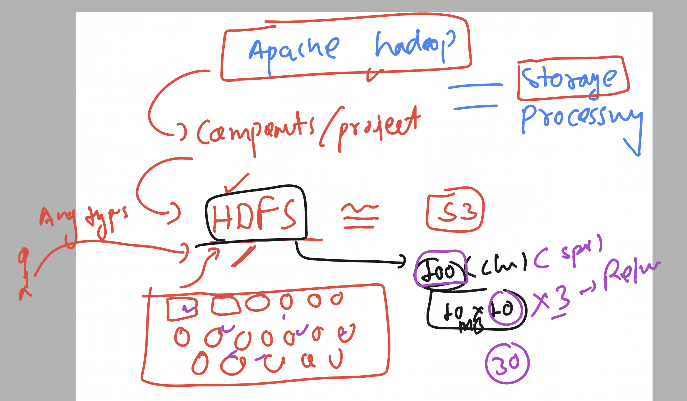

### MAP reduce 

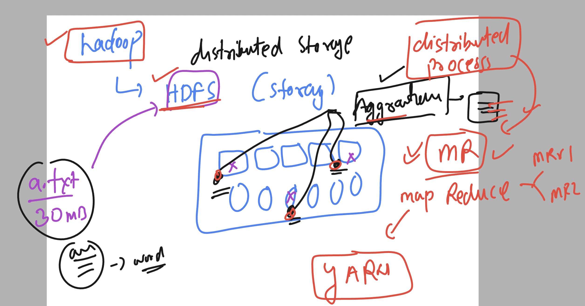

## Introducing in memory data processing engine 

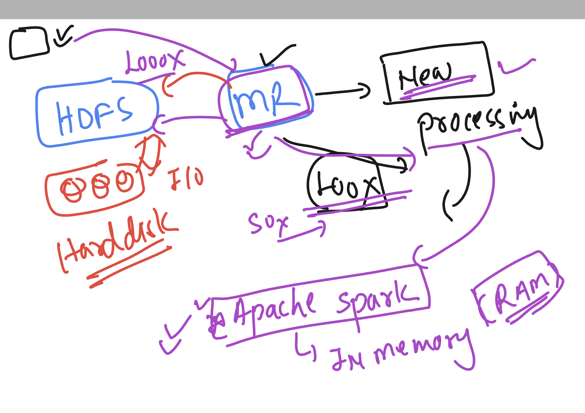

### spark in more detailed

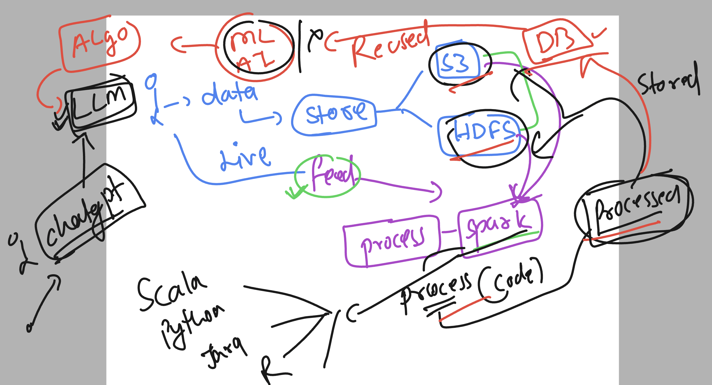

### ETL process

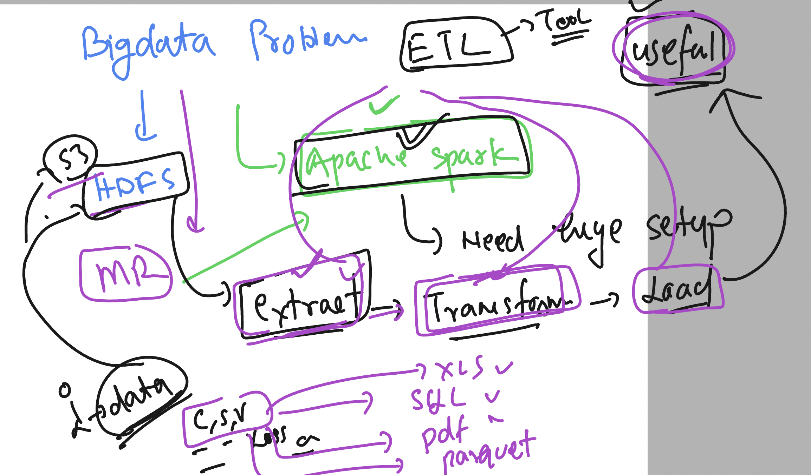

### AWS GLUE is -- ETL tool backed by apache spark as processing 

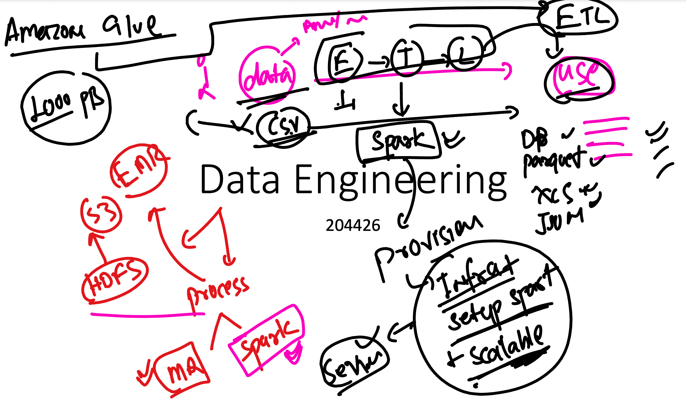

### More about ETL -- 

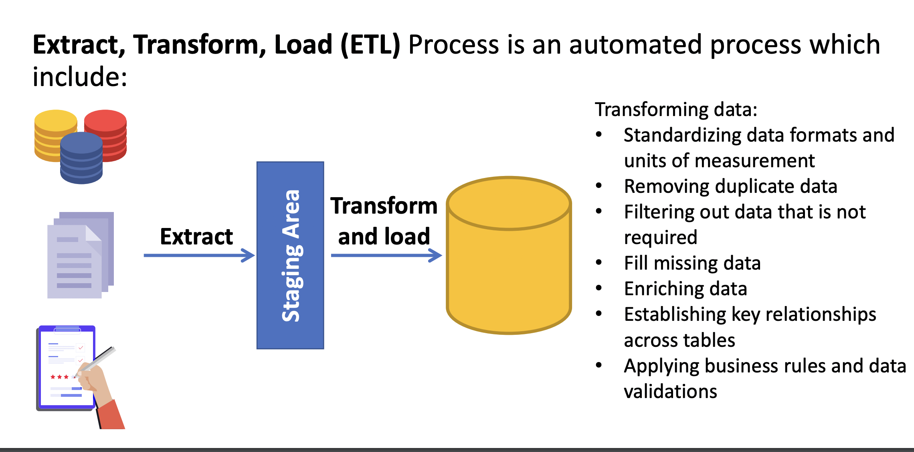

### spark to glue changes

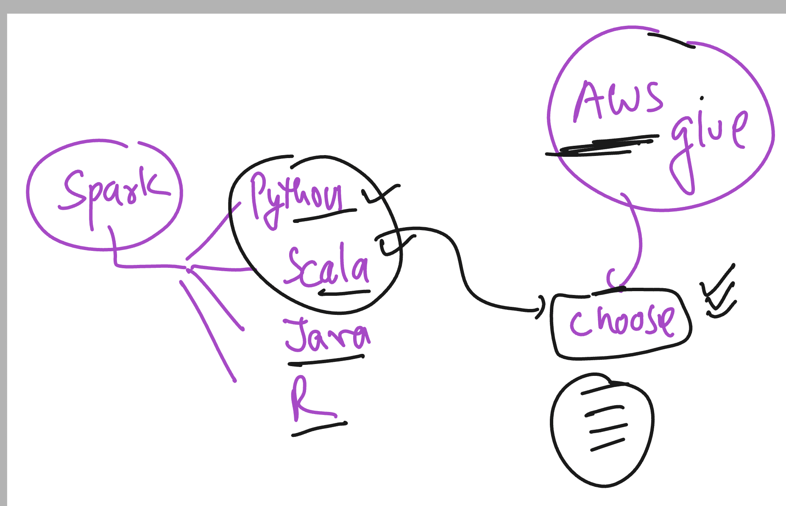

## aws glue understanding 

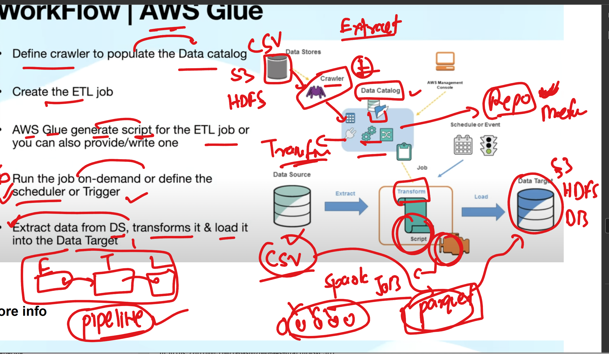

### data pipline and crawler for glue 

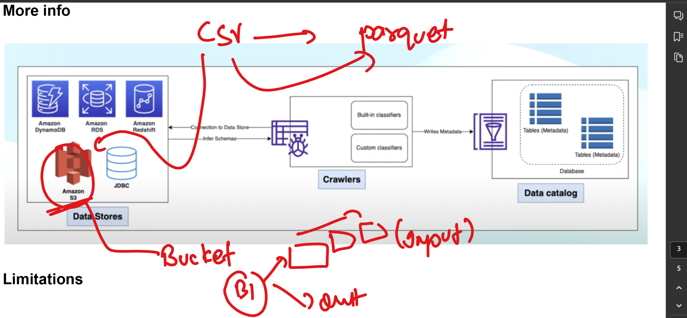

