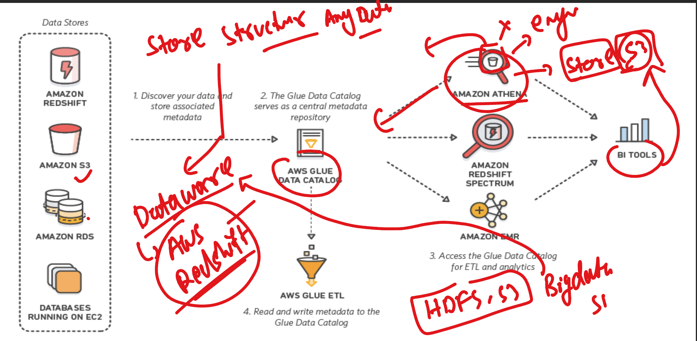
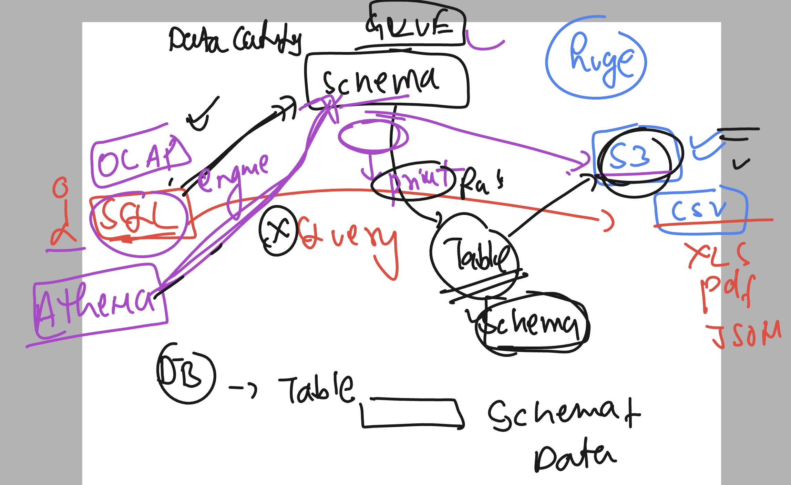
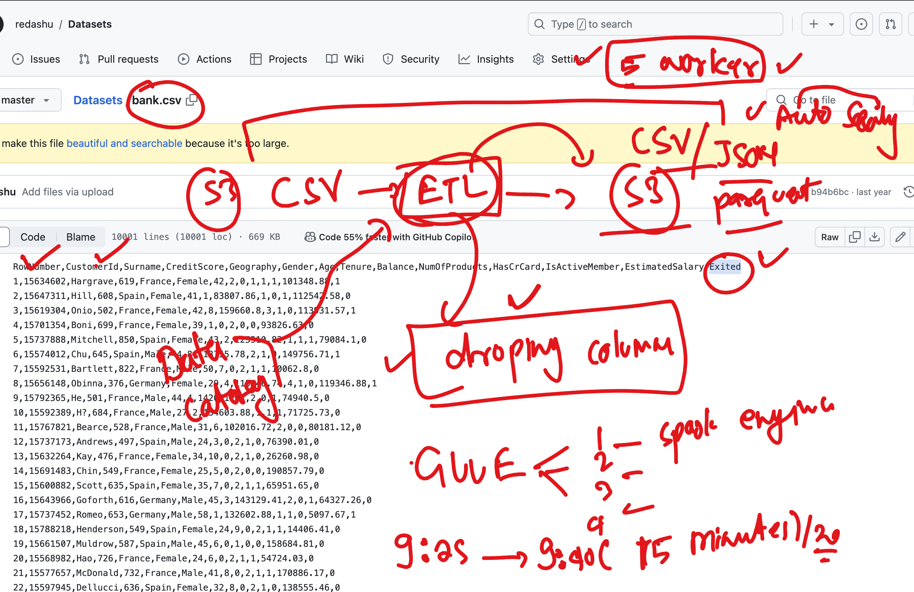
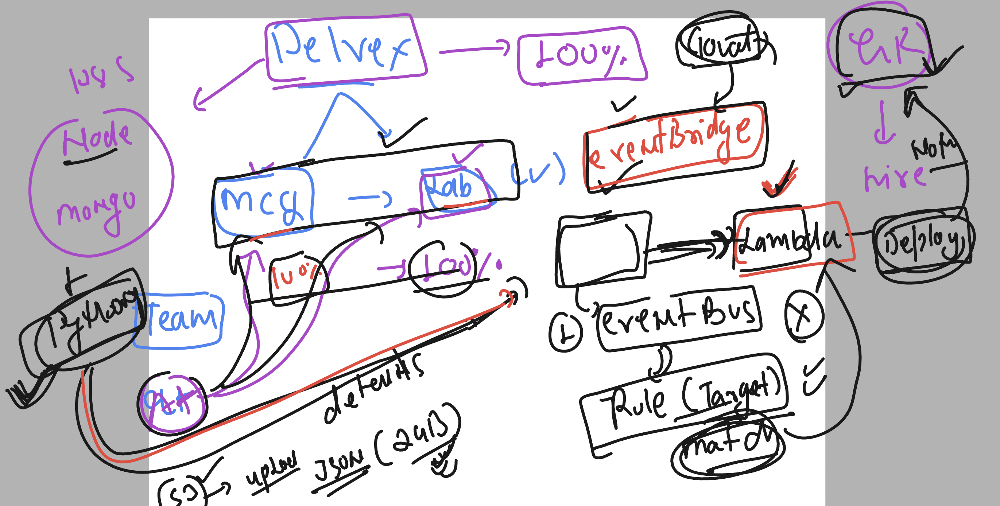
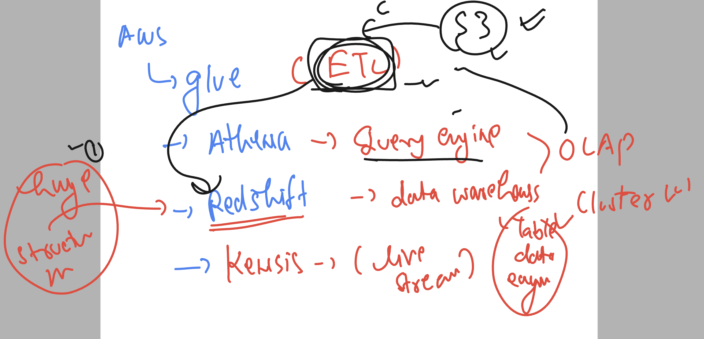
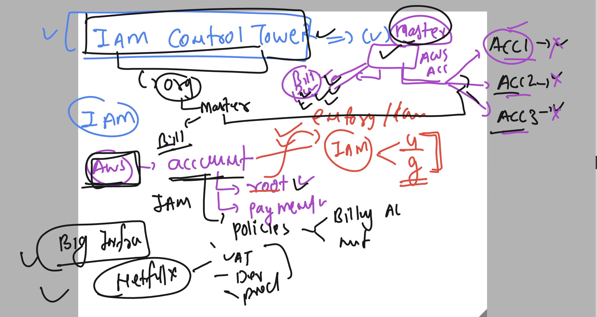

# bmo-aws-platformSVC

## Revision 

## Storage understanding 

### OLTP vs OLAP 

### OLAP engines 

### Introduction to aws athena 

### More info about athena 

### athena to use aws glue catalog table schema to run SQL like query 

### create ETL job 

### Eventbridge service -- an extended version of cloudwatch events section 

## data services 

## IAM control tower

