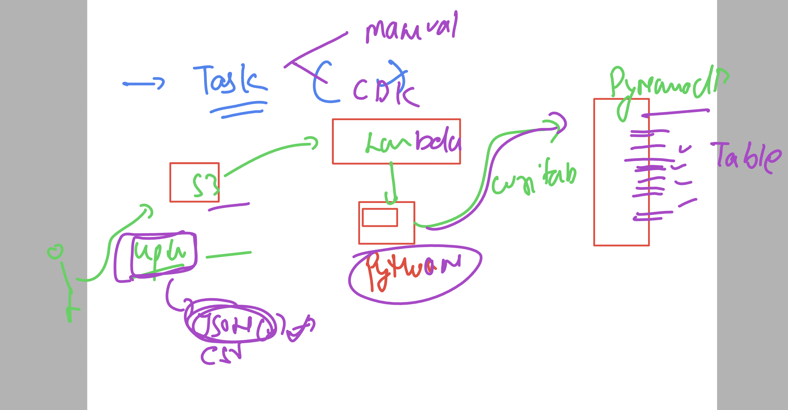

## First IAM  Task 

- Create a Role with following details
- it will only access ec2 full access 
- user whosoever using this role using policy can launch instance in NV (us-east-1)
- make sure they can only launch ec2 of t2.micor , t2.small type 
- make sure this one you have to perform using cdk including user and policy creation part
- make sure user password use are storing in aws secrets not in plaintext

### CDK / manual task for user load to s3 and entry in dynamodb table using lambda 

